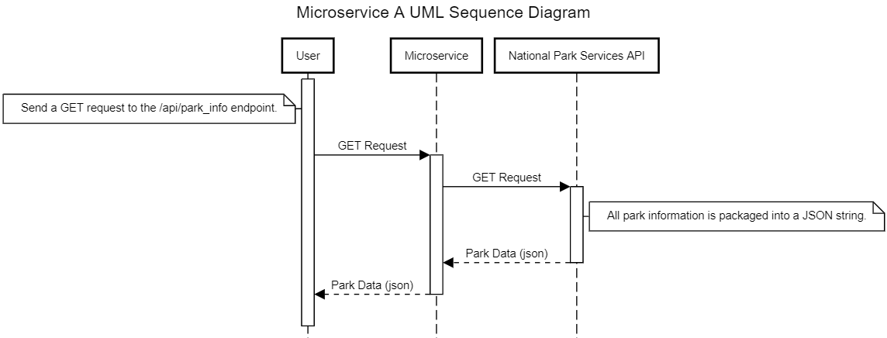

Microservice A Instructions and Communication Contract.

This microservice provides access to park information from the National Park Services API.

To request data, run app.py. This flask application will set up on a port (default 5000) and listen 
for requests to the /api/park_info endpoint. Use an HTTP client to create a GET request for this endpoint.

Example Request in a Python File:

import requests

response = requests.get('http://127.0.0.1:5000/api/park_info')
park_info = response.json()
print(park_info)

To receive the data, parse the response from the GET request. A json string will have all information 
regarding each park in the database.

